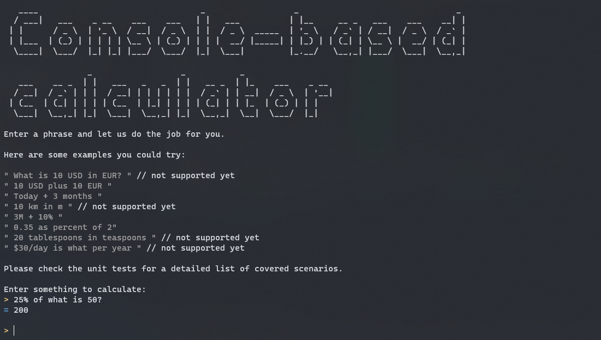

# notepad-based-calculator

This is a unfinished project, but it is in a state where you can easily reuse it.

# The concept
Making an app similar to [numi.app](https://numi.app), [soulver.app](https://soulver.app) and [parsify.app](https://parsify.app), cross-platform using C#.

# Current state
The calculator engine is about 100% done. But it remains a few features I wanted to add that I didn't finish.

| Feature                                  | Example                                    | Support |
| ---------------------------------------- | ------------------------------------------ | ------- |
| Basic algebra using digits               | 2 + 3                                      | ✅      |
| Basic algebra using plain words          | two plus three                             | ✅      |
| Implicit algebra operations              | 20 (50)                                    | ✅      |
| Nested grouped operation                 | (12)3+(1 +2)(3(2))(1 +2)-3                 | ✅      |
| Binary operations                        | 0.2 >= a fifth                             | ✅      |
| Percentage calculation                   | 10 + 25%                                   | ✅      |
| Comments                                 | 12 + 3 // anything after "//" is ignored   | ✅      |
| Headers                                  | # Title                                    | ✅      |
| Variables                                | my income tax = 25%                        | ✅      |
| Conditions                               | if my income tax > 30% then $123 else $456 | ✅      |
| Unit calculation                         | 2km + 25% // should result 2.5 km 2 USD + 2 CAD // should result something like 3.05 USD 3 MB - 2 KB // should result 2.998 MB Supports length, mass, currencies, area, angle, volume, speed, temperature, date and time, percentage, computer data          | ✅      |
| Function grammars (see detail below)    | PERCENTAGE of what is NUMERIC i.e: 25% of what is 50 // should result 200 | ✅      |
| Multilanguage                            | deux plus trois | ✅ (partial)      |
| Unit conversion                          | What is 1 USD in EUR 1km in meters **Shouldn't be too complicated to implement using _function grammar_** | ❌        |

**Please check the unit tests for a complete list of supported scenarios.**

# Technical details

## Overall architecture

* **NotepadBasedCalculator.Api** 
This is the public API.
* **NotepadBasedCalculator.Core** 
This is core engine. It contains the lexer, parser and generic interpreter.
* **NotepadBasedCalculator.BuiltInPlugins** 
Contains all the basic extensions, which includes the components for parsing and interpreting units, basic algebra and binary operation and built-in functions grammars.

* **NotepadBasedCalculator.StandaloneConsoleTestApp**
This is a console app you can use for testing the calculator manually. Check out how this project is made to understand how to use the calculator.

## Extensiblity & Dependency injection

This project uses [MEF](https://learn.microsoft.com/en-us/dotnet/framework/mef/) as primary dependency injection & extensibility framework.

## Function grammars

The calculation engine supports various kind of input data: percentage, length, numbers, etc.
While this app/library tries to be smart enough to understand input like `25% of what is 50`, it isn't smart enough to understand such an input without the help of a pre-defined grammar.

The full grammar for English language can be found here: [FunctionDefinition.json](https://github.com/veler/notepad-based-calculator/blob/main/src/app/dev/NotepadBasedCalculator.BuiltInPlugins/Grammars/en-us/FunctionDefinition.json)

Each function is associated to a [MEF](https://learn.microsoft.com/en-us/dotnet/framework/mef/) extension. The C# implementation automatically binds the class with the function name from the grammar. Here is an example:
1. [Grammar for `25% of what is 50`](https://github.com/veler/notepad-based-calculator/blob/84c8842b1f15572c9f27608f0c09c0e059a17017/src/app/dev/NotepadBasedCalculator.BuiltInPlugins/Grammars/en-us/FunctionDefinition.json#L25-L33)
2. [Implementation in C#](https://github.com/veler/notepad-based-calculator/blob/84c8842b1f15572c9f27608f0c09c0e059a17017/src/app/dev/NotepadBasedCalculator.BuiltInPlugins/Functions/Percentage/IsPercentOfWhatInterpreter.cs#L3-L51)

## Main third-party dependencies for the calculator engine
- [Community Toolkit](https://github.com/CommunityToolkit/dotnet)
- [Microsoft.Recognizers.Text](https://github.com/microsoft/Recognizers-Text)
- [UnitsNet](https://github.com/angularsen/UnitsNet)
- [Newtonsoft.Json](https://www.newtonsoft.com/json)

# How to build and run?

## Set up development environment
- Visual Studio 2022 with Desktop Development workload (Windows)
- Rider (Windows or MacOS)
- VS Code with C# extension (MacOS)
- _**(Optional)**_ [Avalonia UI](https://docs.avaloniaui.net/docs/getting-started)

## Set up repository
1. Clone the repository
2. Run `init.ps1` (or `.sh`) to download all the required dependencies.

## Build & Debug
1. Open `src/NotepadBasedCalculator.App.sln` in Visual Studio or Rider.
2. Set `NotepadBasedCalculator.StandaloneConsoleTestApp` as startup project.
3. F5 😉